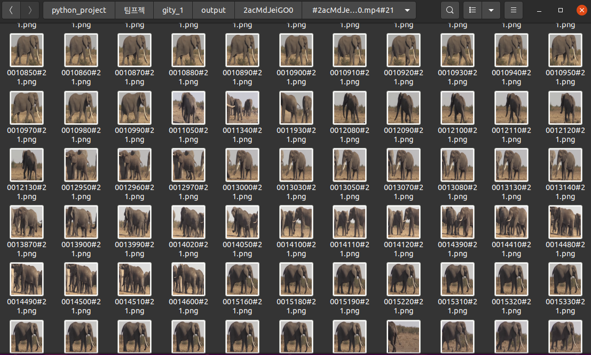

# GITY
Gather Image Through Youtube
---
유튜브에서 원하는 객체를 검출하여 이미지로 저장해주는 코드입니다.  




## 목차

- [환경](#environment)
- [설치](#installation)
- [실행](#run)
- [작성자](#author)
## Environment
+ OS  
  __리눅스__ 에서 테스트를 진행했습니다.
+  GPU  
  __RTX3090__에서 테스트를 진행했습니다.
+ Tensorflow  
  __tensorflow 2.0__ 이상 에서 작동합니다.


## Installation
0. clone repogitory
```
git clone https://github.com/kyeul611/gity.git
cd ./gity
```
1. 모듈 설치
```
pip install -r requirements.txt
```

2. chromedrive
```
apt-get update
apt install chromium-chromedriver
```
3. youtube-dl
```
wget https://yt-dl.org/downloads/latest/youtube-dl -O youtube-dl
chmod a+rx youtube-dl
```

#### Detector
1. detection-weight

   [이곳](https://drive.google.com/drive/folders/1zB0tJ1U7zNmxUGGbpSF9RhG2szbK1m1r)에서 __yolov3.tf.data-00000-of-00001__ 파일을 다운받아 __gity/yolov3_tf2__ 폴더 안으로 옮겨주세요.


## run

터미널에서 아래 명령어를 실행
```
python main.py --keyword [키워드] --class_name [클래스 종류] 
```

  ___Detection Class___
   Object-detector는 ImageNet Dataset에 대해서 작동합니다.
   탐지 가능한 클래스 종류는 [이곳](./information/class_list.txt)에서 확인 가능합니다.

example:

```
python main.py --keyword tusker\ elephant --class_name elephant --num_video 5 
```

추가 인자는 아래 명령어를 통해 확인하세요.
```
python main.py --help
```


## references

다음 Open source를 참고하였습니다.

+ [video-preprocessing](https://github.com/AliaksandrSiarohin/video-preprocessing)

+ [object detector](https://github.com/zzh8829/yolov3-tf2)


## author

```python
{
	"박 결" : "gyul611@gmail.com",
	"정민혁" : "tlsfk48@gmail.com",
	"이제헌" : "dlwpgjs0723@gmail.com",
}
```
